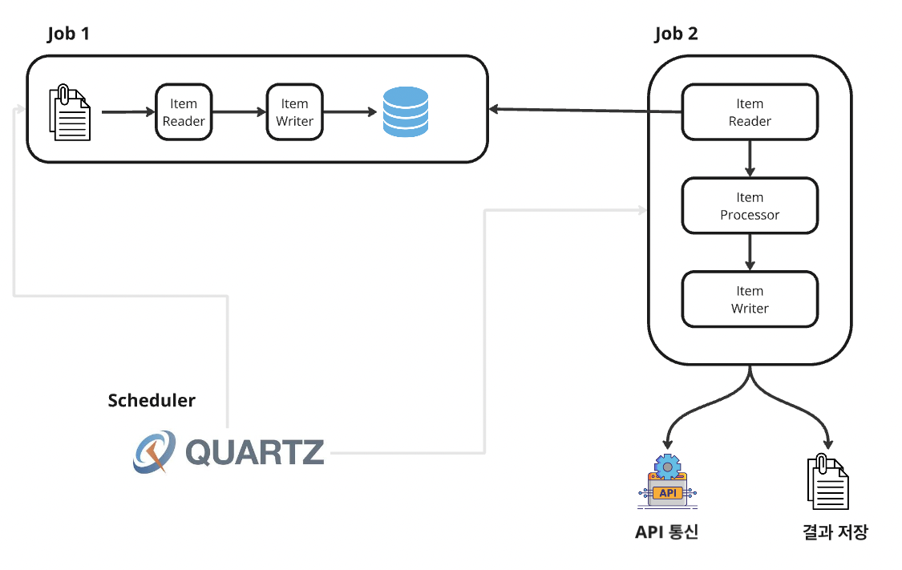

# Job 1
- 기능
    - 파일로 부터 데이터를 읽어서 DB에 적재한다.
- 세부 내용
    - 파일은 매일 새롭게 생성된다.
    - 매일 정해진 시간에 파일을 로드하고 데이터를 DB에 업데이트 한다.
    - 이미 처리한 파일은 다시 읽지 않도록 한다.

# Job 2
- 기능
    - DB에 저장된 데이터를 읽어서 API 서버와 통신한다.
- 세부 내용
    - partitioning 기능을 통한 멀티 스레드 구조록 Chunk 기반 프로세스를 구현한다.
    - 제품의 유형에 따라서 서로 다른 API 통신을 하도록 수엏나다.
    - API 서버는 3개로 구성하여 요청을 처리한다.
    - 제품 내용과 API 통신 결과를 각 파일로 저장한다.

# Scheduler
- 기능
    - 시간을 설정하면 프로그램을 가동시킨다
- 내용
    - 정해진 시간에 주기적으로 Job 1, Job 2를 실행한다.
    - Quartz 스케줄러를 사용하여 구현한다.

# 구조도
